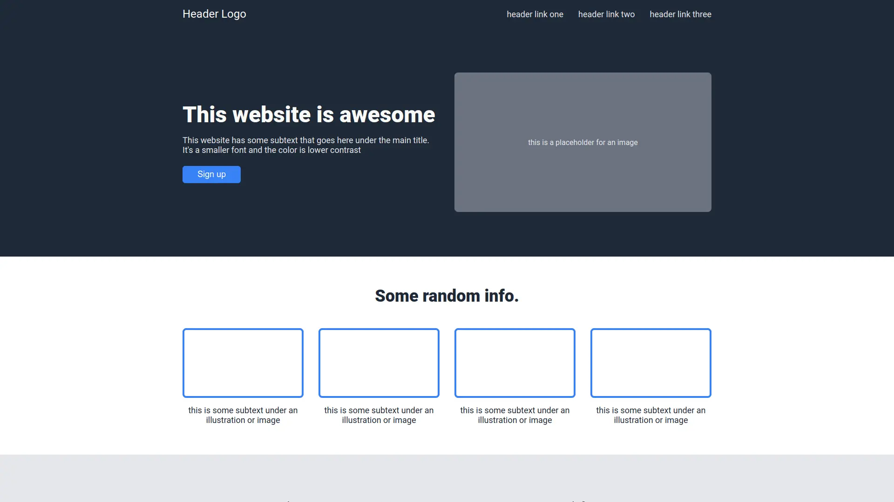

# The Odin Project: Landing Page

Landing page practise project, made in Astro.



## 🚀 Project Structure

Inside of the project, you'll see the following folders and files:

```text
/
├── public/
│   └── favicon.svg
├── src/
│   ├── components/
│   │   ├── CallToAction.astro
│   │   ├── Card.astro
│   │   ├── Footer.astro
│   │   ├── Header.astro
│   │   ├── Hero.astro
│   │   ├── Info.astro
│   │   └── Quote.astro
│   ├── layouts/
│   │   └── Layout.astro
│   └── pages/
│       └── index.astro
└── package.json
```

## 🧞 Commands

All commands are run from the root of the project, from a terminal:

| Command                   | Action                                           |
| :------------------------ | :----------------------------------------------- |
| `npm install`             | Installs dependencies                            |
| `npm run dev`             | Starts local dev server at `localhost:4321`      |
| `npm run build`           | Build your production site to `./dist/`          |

